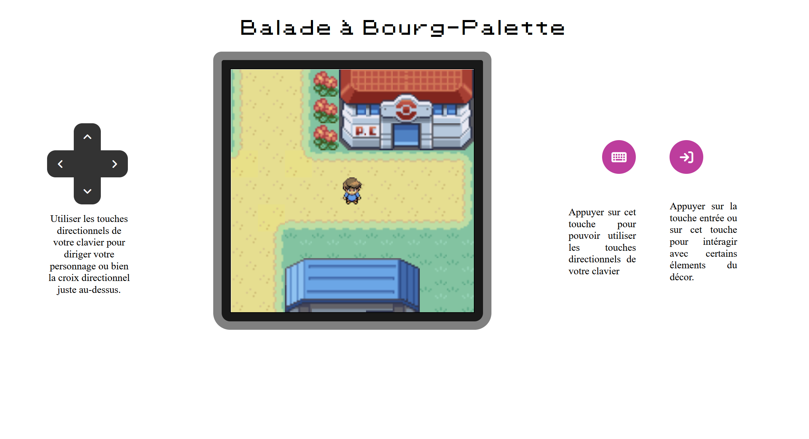
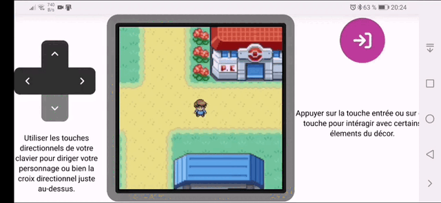
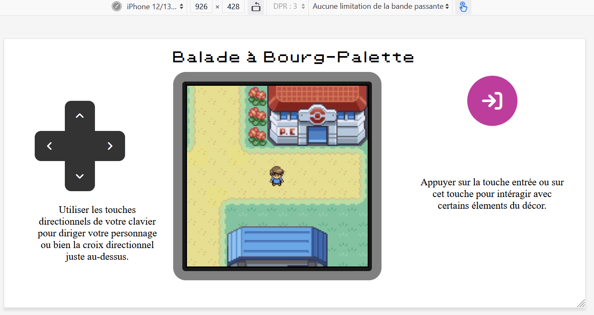

# Balade à Bourg-Palette version 2 !

Balade à Bourg-Palette vous permettra de vous balader sur une map dans le style de Pokémon ainsi que de visiter le centre Pokémon et la boutique. Vous pouvez utiliser, soit votre clavier, soit les touches qui sont à l'écran.

Cela a été rendu possible grâce à React !
Une version sans avoir besoin de back-end et de base de données.
Par ailleurs, un dark-mode a été ajouté.

Pour le fonctionnement, n'oubliez pas d'installer les dépendances.

# Quelques images

Enjoy !

Contactez-moi :

